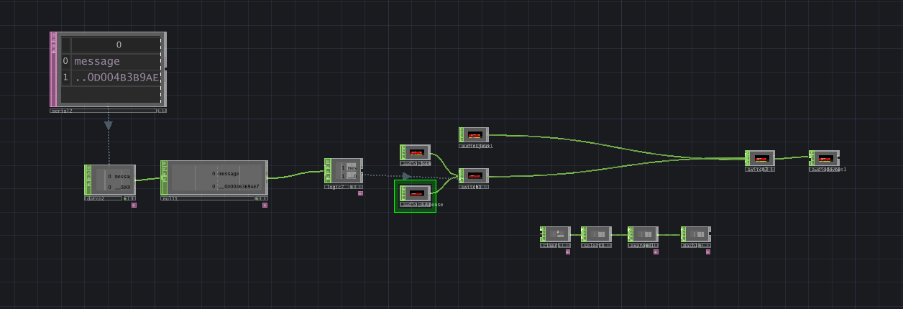

## Capsule promotionnelle

Notre caspsule promotionnelle illustre le développement de la version complète de notre projet.

## RFID Sons
Pour pouvoir changer la musique d'ambiance du jeux avec un des désavantages, nous avons ajouté le capteur RFID avec un opérateur 
serial qui ensuite quand scanné donne 1 ou 0. 1 va partir le son du désavantage et le deuxième le remet à 0 pour remettre la musique d'ambiance.

