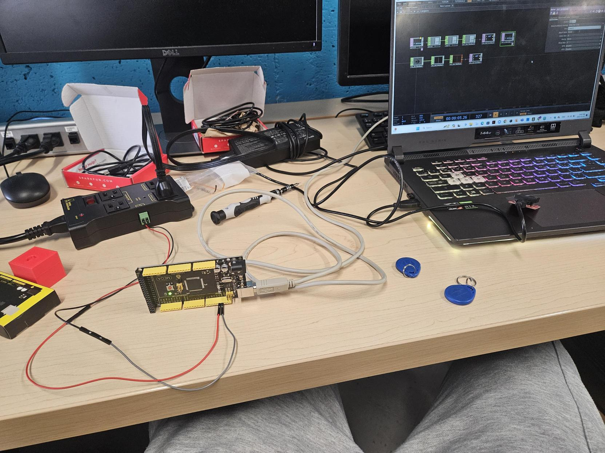
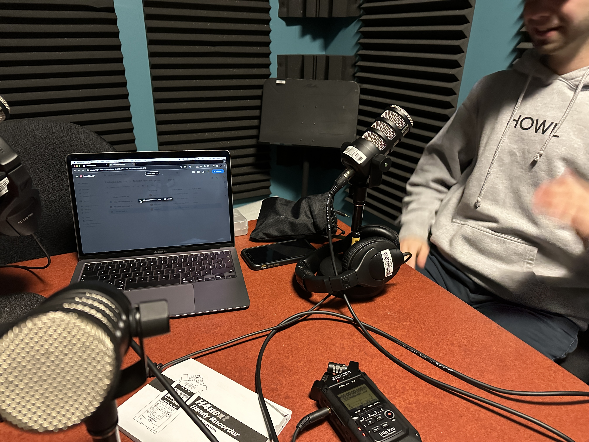
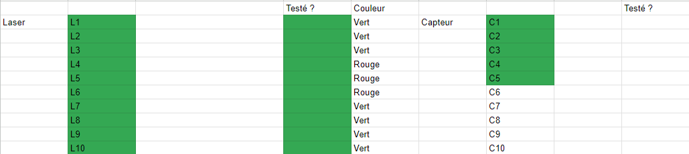

## Ajout du relais

Pour permettre, avec les désavantages, de partir et refermer les lasers additonnels et les plaques de pression, nous avons ajouté un relais qui sera ouvert et fermé à l'aide d'un RFID. Scanner une fois pour l'ouvrir et une autre fois pour le fermer. Tout ça, fait sur TouchDesigner.

## Enregistrement de la bande sonore alternative

Cette semaine Cédric et Hugo sont allés au studio d'enregistrement pour la création de la bande audio alternative de Mission Presqu'impossible. Il s'agit principalement de la reprise de la bande audio originale par Cédric et Hugo par leur...bouche. C'était un moment très drôle, mais ils avaient un peu sous-estimé comment il n'était pas simple de ne pas rire pendant l'enregistrement.

## Capteur

De son côté , Cédric à complété la soudure des capteurs et a débuter un document pour se retrouver dans tous ces fils. Les lasers se nomment L# et les capteurs C# et ils sont mis en vert quand le test de fonctionnalité a été fait.

