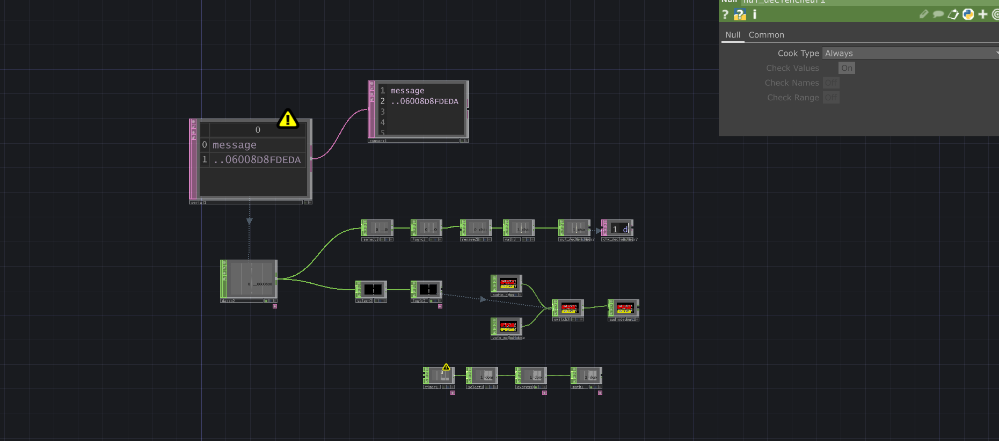

## Amélioration de notre installation

Nous avons décidé de changer nos lasers rouges pour des verts, puisqu'ils n'étaient pas assez forts et on ne les voyait pas bien.  

Cédric : 

J'ai dû faire le changement des lasers alors j'ai encore fait de la soudure ! J'aurais aimé participer un peu plus à la programmation, mais les ajustements de dernières minutes m'ont empêché de le faire. Maintenant , les lasers sont fonctionnels et j'ai vraiment hâte de les essayer avec la fumée.

## Tubes de lumière Godox

Voici un de nos tubes de lumière que nous utiliserons (si nous pouvons) sur le haut de notre installation.

Cédric : 

Nous avons découvert que les tubes ne se ferment pas avec la prise électrique, car la charge s'active ou se désactive lors de l'activation de celle-ci. Notre plan pour activer ou fermer les lumières est tombé à l'eau. J'ai donc avec l'aide de Hugo regardé de plus prêt l'application sur le téléphone et nous avons établi que les lumières seront fermées à distance avec un téléphone (ou la manette).

## Ambiance Sonore

Voici Hugo qui bonifie l'ambiance sonore de notre installation.

## Optimisation des RFID dans Touchdesigner

Pour cette étape de la production, on cherchai à améliorer l'utilisation des RFID`s mais on n'était pas capâble d'utiliser seulement qu'un RFID pour les plusieurs différent désavantages. Maintenant il est optimiser pour que seulement 1 RFID est nécessaire pour plusieurs carte scanner qui intéragissent différament.

