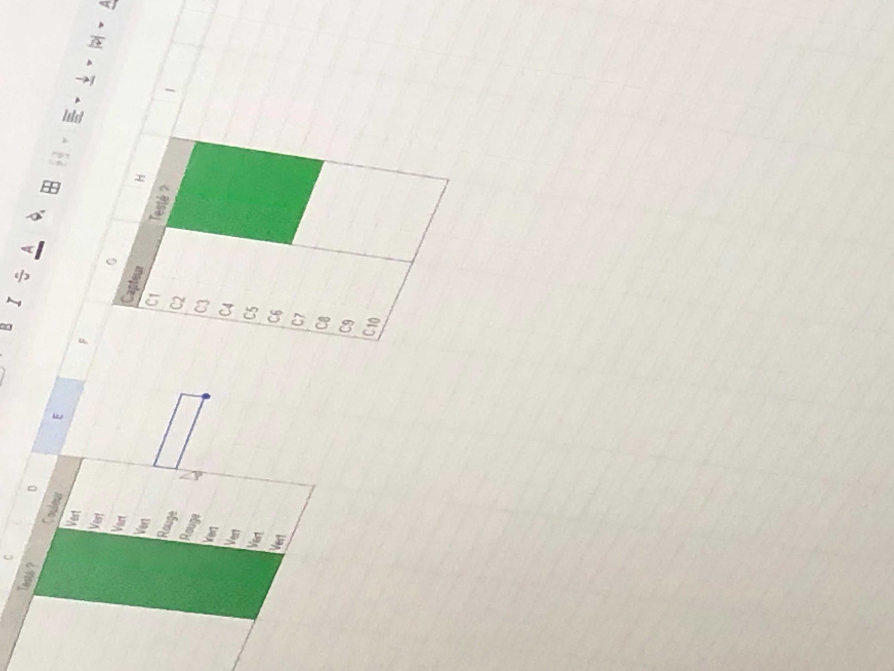
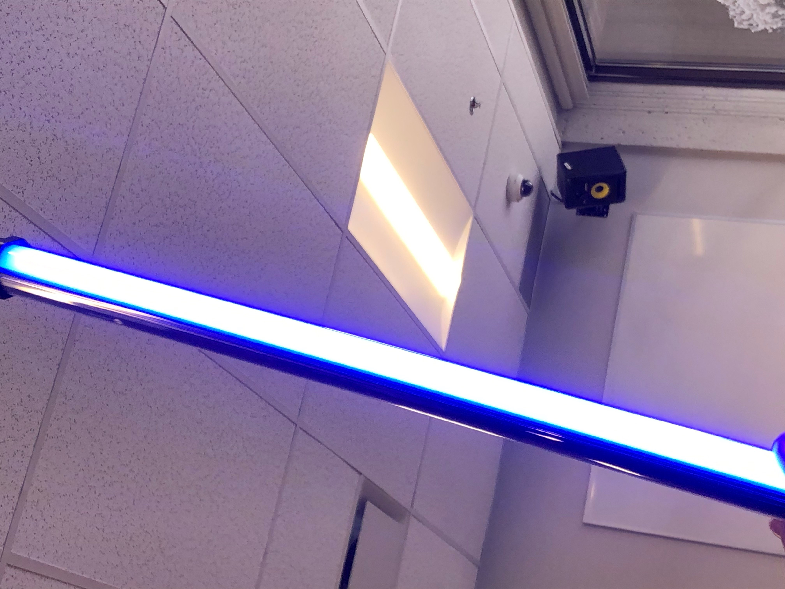
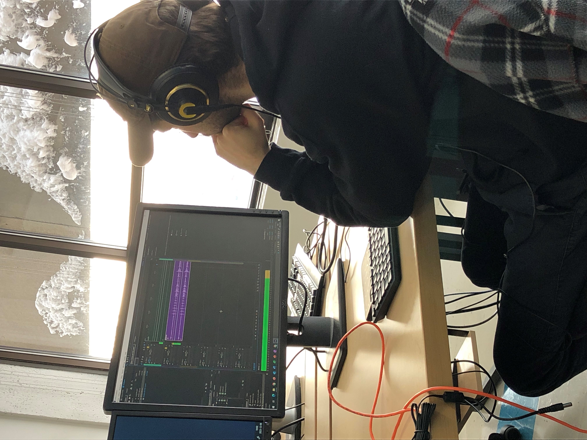

## Amélioration de notre installation

Nous avons décidé de changer nos lasers rouges pour des verts, puisqu'ils n'étaient pas assez forts et on ne les voyait pas bien.  

## Tubes de lumière Godox

Voici un de nos tubes de lumière que nous utiliserons (si nous pouvons) sur le haut de notre installation.

## Ambiance Sonore

Voici Hugo qui bonifie l'ambiance sonore de notre installation.

