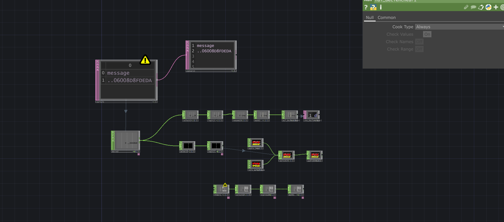

## Optimisation des RFID dans Touchdesigner

Pour cette étape de la production, on cherchai à améliorer l'utilisation des RFID`s mais on n'était pas capâble d'utiliser seulement qu'un RFID pour les plusieurs différent désavantages. Maintenant il est optimiser pour que seulement 1 RFID est nécessaire pour plusieurs carte scanner qui intéragissent différament.

