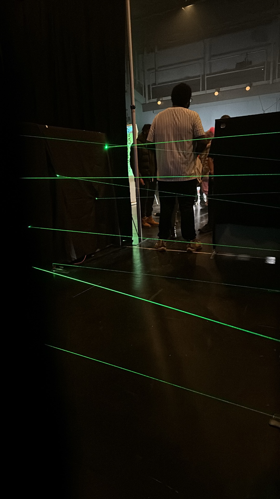
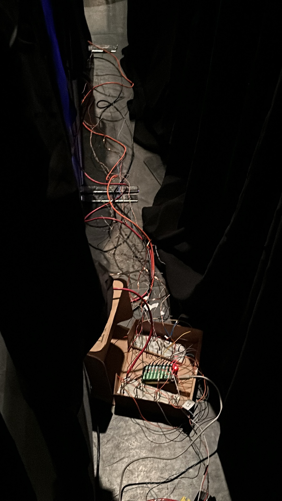
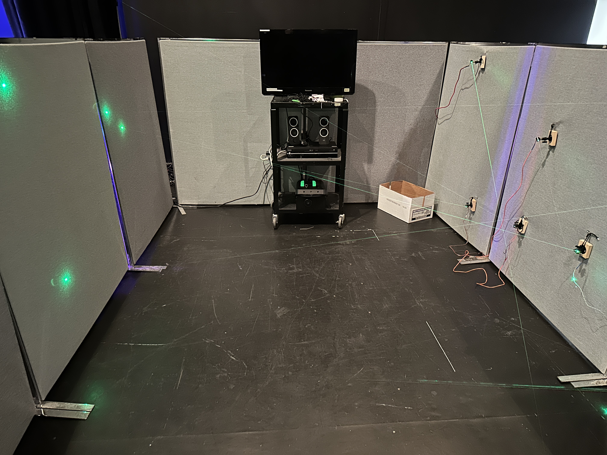
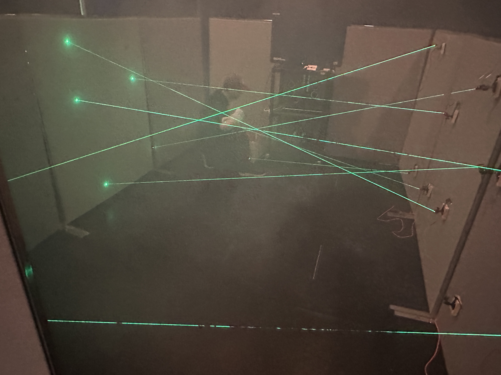
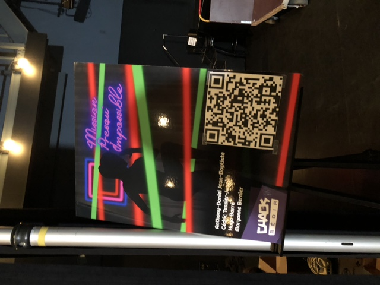

## Sons finale du projet

Une des étapes finales qui nous restait, avec les sons produit par Hugo et Cédric, On a pu mettre les bonnes version de chaque son que ce soit gagner des points, toucher les lasers, perdre des points et musique d'ambiance. Tous les sons finales sont maintenant dans le projet.

## La soirée Chaos Media ##

Cédric :

La journée du 19 décembre n'aura pas été vraiment facile pour nous. Nous avons beaucoup travaillé pour cette journée, mais malgré l'aide-externe , nous n'avons pas pu livrer ce que nous voulons vraiment avoir comme expérience. Les capteurs de lumière et RFID n'ont pas fonctionné comme prévu alors nous avons dû nous retourner sur une version "manuelle" de notre jeu. Nous avons malgré tout reçu de bons commentaires des gens qui ont participé à  notre  jeu, car les lasers c'est toujours sympathique à voir. J'ai passé une bonne partie de ma soirée assis dans un coin du jeu en cachette pour ajuster la difficulté ,  dire les points et allumer les lumières au besoin.

Mon point de vue de la soirée : 

Les premières étapes de notre installation terminée : 

Notre affiche sur place pour l'évènement:

{::comment}
fin de la section pour Cédric
{:/comment}

__________________________________________________________________________________________________________

J'ai eu le temps de filmer notre installation lorsqu'il n'y avait pas de partie en cours :

