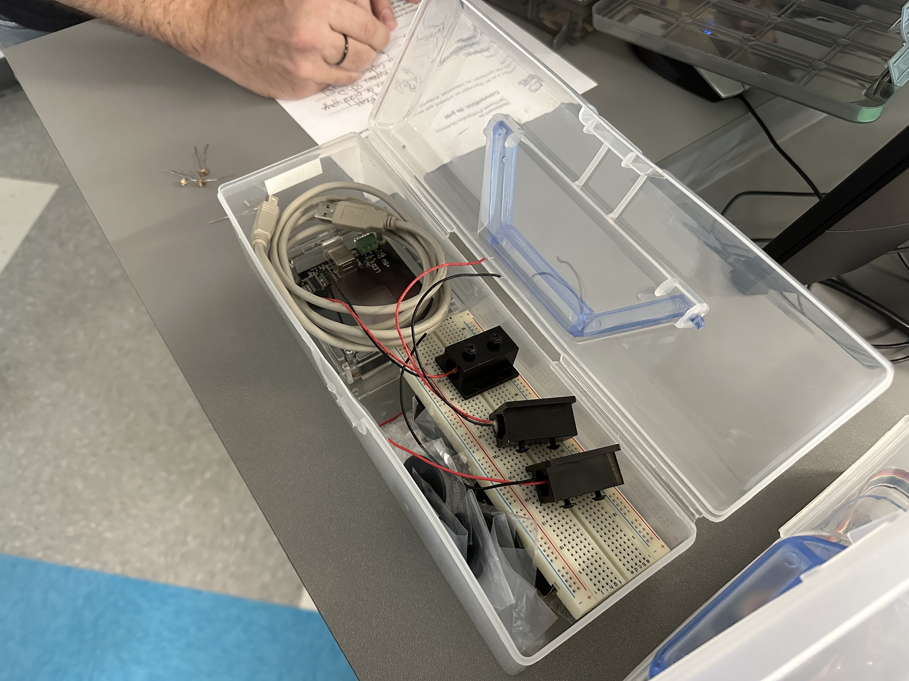
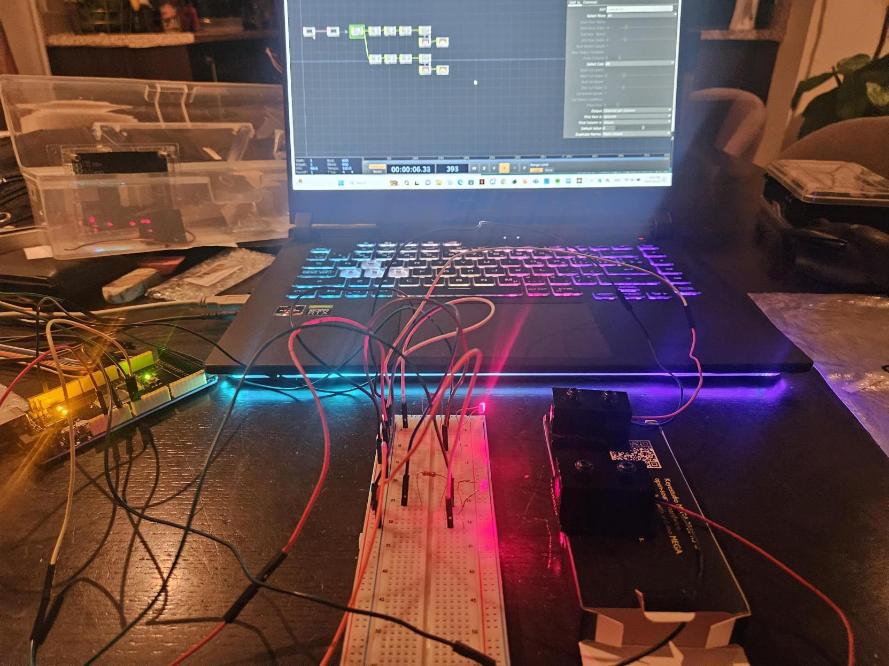
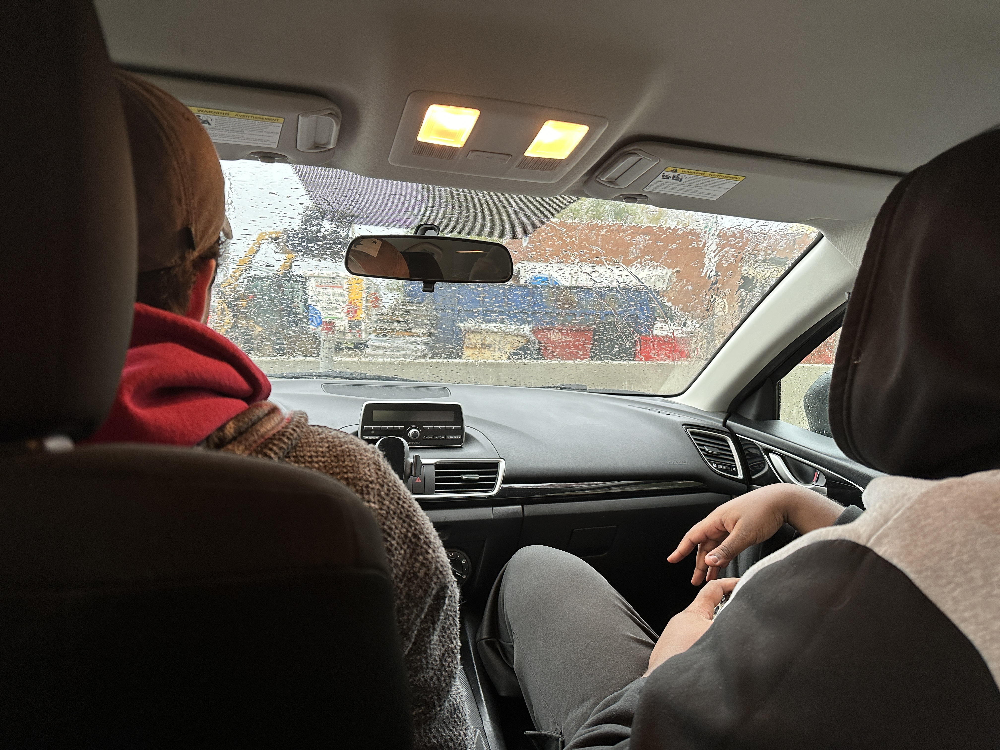

## Épopée des lasers

Lors de la première démonstration technique, nous avons utilisé les mauvais capteurs de lumière pour tester les lasers, mais nous avons réalisé notre erreur vers la fin du premier cours. Une fois que nous avons eu accès aux capteurs appropriés, tout a fonctionné correctement. Cependant, les capteurs de lumière corrects nécessitent une résistance pour éviter qu'ils sautent, ce qui représente un défi pour le montage final.

La taille des capteurs rend la calibration essentielle, car il est facile que le laser les contourne, ce qui rendrait l'installation inopérante. Il sera donc impératif de mettre en place un processus efficace de calibrage des lasers.

## Ajout de lasers
Anthony dit :
Comme avancement dans le projet, j'était en charge des lasers pour commencer à les faire marcher dans TouchDesigner. Pour commencer j'en ai seulement programmer deux et j'ai fais qu'un son joue quand le laser est blocker par un objet ou ma main.

C'était majoritairement facile, la seule complexité était de retrouver comment on peut ajouter plusieurs donner de plus que 1 capteur de ArduinoIDE à TouchDesigner

## L'achat des câbles

Un autre point marquant de notre semaine a assurément été notre visite chez ST-HUBERT FER & MÉTAUX sur le chemin Chambly à Saint-Hubert. Nous sommes allées visiter l'endroit avec la volonté d'acheter des câbles nécessaires à  bas prix vus le grand nombre que nous avons besoin pour le projet. Lors de cette visite , il y pleuvait ce qui nous a un peu compliqué la tâche lors de la recherche, mais l'ensemble s'est bien déroulé. Nous avons dû demander la participation du grand-père de Cédric puisqu’aucun de nous n’avait le montant en argent nécessaire en espèce pour le commerçant qui ne prenait aucune carte de paiement.

## L'organisation

Un point important de la semaine 8 a également été celui de l'organisation de notre projet. Nous sommes maintenant plus surs des dimensions nécessaires à notre projet et nous avons établi les rôles officiels de chaque membre de notre équipe. Nous sommes même allés visiter les sous-sols du CÉGEP pour nous informer sur la taille de certains meubles nécessaire à notre installation.

