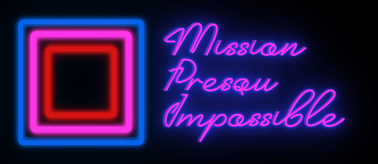
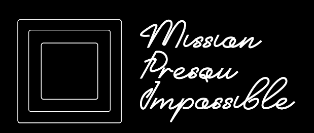
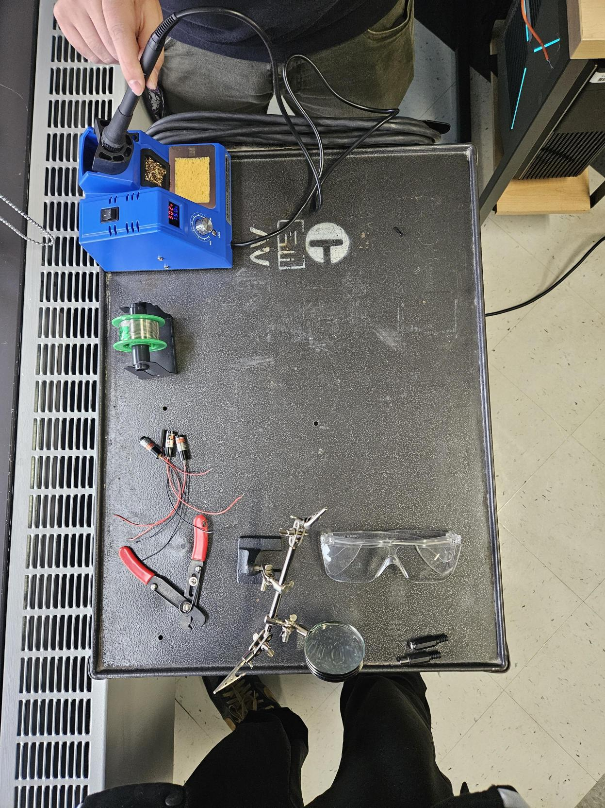
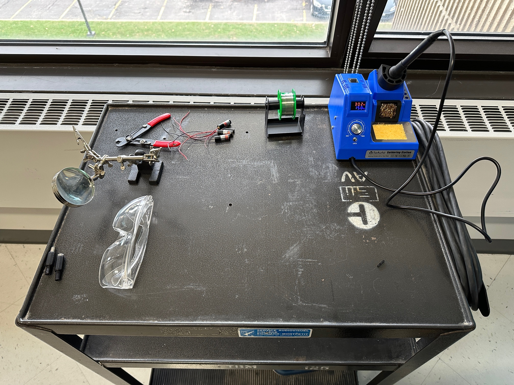

## Notre logo

Voici notre logo définitif crée par Cédric. Nous avons choisi un style qui s'oriente un peu plus dans le neon que dans le pixelart. C'est une décision d'équipe et Cédric est venu revoir notre logo.

## Inventaire de nos besoins
Une étape importante s'est réalisée cette semaine. Nous devions voir à créer l'inventaire de nos besoins. Nous avons maintenant dans notre cassier d'équipe presque tout le matériel nécessaire à la réalisation de notre projet !

## Cours de soudure
En vue de pouvoir avoir une meilleur connection de fil et éviter que les fils se détache facilement, Anthony et Cédric on eu un mini cours de soudure en class avec Jean-Philippe Coté. Ils ont coupé 3 fils à 4.2 mètres de long pour avoir la bonne longueur de fil

## Concrétisation du montage

Ceci est une photo du découpage de notre capsule promotionelle contenant la présentation de nos membres et le concept de notre projet.

